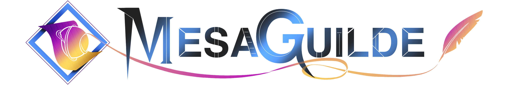

<picture>
  <source media="(prefers-color-scheme: dark)" srcset="MesaGuilde_Logo_Transparent.png">
  
</picture>

---

Inspired by the camaraderie of tabletop games, our small ‘guild’ of close friends creates video games that are designed to be enjoyed together. 
Whether its a tactical twist on pool or an open world bounty hunter saga, every project crafted is curated to tell a story, spark strategy and welcome shared laughter. 

Although our goal is to develop games for people to enjoy, we have created tools that do put us develoepers first, but we wish to offer to those also interested in developing games. 
Our tools use JavaScript as a communication layer from the developer and the framework, and C++ is actually used to develop our games.
Our strongest example is our game engine with a "build once, run anywhere" solution to gamedev. Carpenter Engine offers an easy to use C++ framework with Scenes and Nodes, while offering a JavaScript CLI that builds for WebAssembly first.
